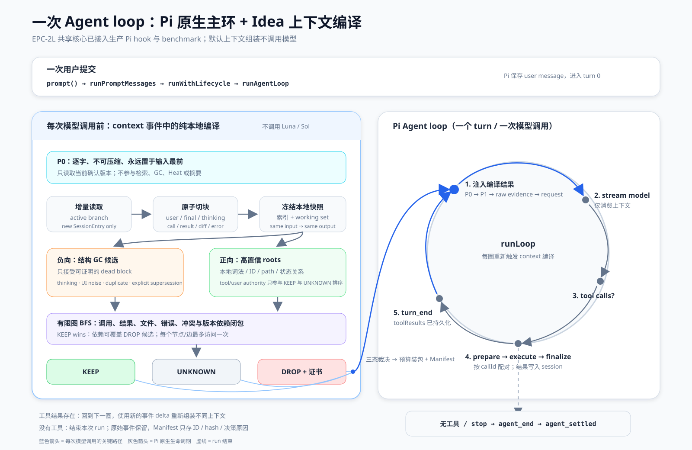

# 当前一次 Agent loop 的流程

这张图严格区分两件事：

1. Pi 已存在的 Agent loop：每次模型调用前触发 `context`，模型若调用工具，工具结果持久化后进入下一圈；没有工具则结束 run。
2. 已确认并在 benchmark-local 验证的 Idea 上下文编译器：每次 `context` 事件中，用纯本地程序完成增量切块、结构 GC、正向 roots、依赖闭包、`KEEP/DROP/UNKNOWN`、预算装包和 Manifest。

当前状态：EPC-2L 共享核心已经同时接入生产 Pi hook 与 benchmark。生产路径使用真实 SessionEntry provenance、项目级 raw SQLite/FTS、结构 DROP 证书、依赖闭包、覆盖停止和 60/85 水位；默认不调用 Luna。Luna 只属于有界 Workflow，其 effort 由任务强度路由，路由与 task card 留在审计记录中。
