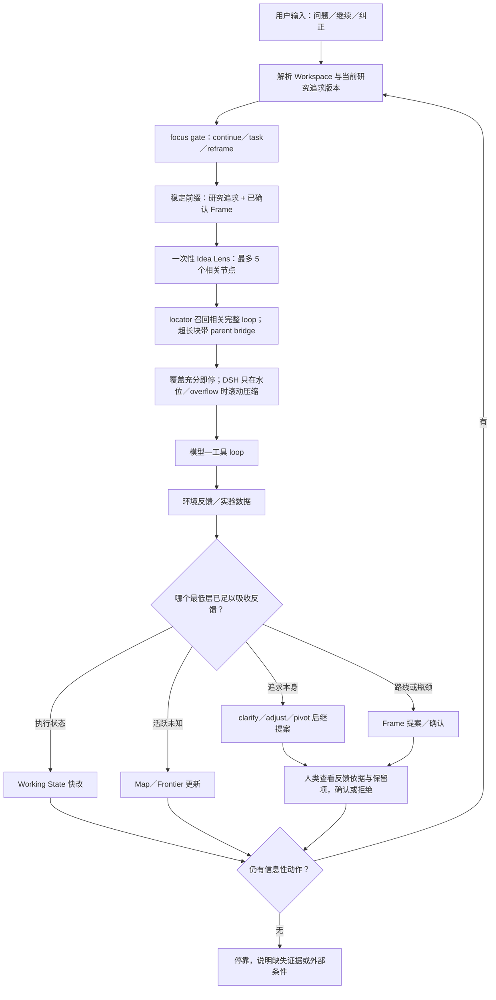

# Pi-Idea Context Assembly Implementation Report

English | [中文](pi-idea-context-assembly-report.zh.md)

Status: mechanisms are implemented and covered by focused tests, host/client builds, live-browser interaction, and a five-scenario DeepSeek V4 Flash behavior probe. This does not claim multi-week scientific-task superiority yet.

## 1. Outcome

The implementation lives in a DeepSeek Harness fork workspace, but the feature itself uses DSH/Cordis atomic plugin seams. AgentLoop, Session semantics, and model adapters remain unchanged. Pi-Idea is composed from research state, controls, selective compaction, projections/UI, and profile bundles.

The ordinary path is model-external state plus a one-request selective view and makes no summarization call. Native DSH `compaction-basic` remains the superclass fallback for pressure, an actual provider-reported context overflow, or manual `/compact`.

Idea Kernel and Research Frame no longer store text hashes. State revision, authority version, and append-only events provide concurrency and provenance. `viewHash` remains only to identify one exact child-visible assembled view. The user-visible Kernel now represents `Research pursuit · slow variable`: every confirmed revision is preserved, while feedback may lead the model to propose and the human to confirm a clarified, adjusted, or pivoted successor.

Putting Idea text in every request is not treated as evidence that the model will attend to it. The active pursuit is therefore a short decision boundary rather than a project brief: scientific object, success evidence, and the most dangerous substitutions only. The Pi-Idea bundle gives it an independent 256-token ceiling and fails visibly instead of truncating it. Immediately after the verbatim slow variable, a model-maintained `task-idea-bridge` states which criterion the current task can change, the next evidence action, and why enabling infrastructure is not itself scientific success. Routes, tools, and process rules stay in Frame or Working State so they do not compete with the current problem for attention.

## 2. Request Path

1. DSH Inbox admits the user's message under its normal rules.
2. On step one, `agent/pre-step` obtains the current request. Later tool steps retain the same live chain.
3. The Session event stream folds Kernel, Frame, Working State, and any pending proposal. Kernel is the verbatim first view segment; pending proposals are excluded. An oversized Kernel fails the assembly under its own attention budget and is never silently clipped.
4. The compact task-to-Idea bridge is placed adjacent to the Kernel, before Frame and history. It binds the current task to one scientific criterion without duplicating authority text.
5. A disposable incremental locator index reads only new events. The append-only Session log remains the fact source.
6. The query combines current messages, Working State, and active Goal. Evidence roots resolve underspecified requests such as “continue”.
7. Candidate scoring combines exact terms, character-form fuzziness, configured aliases, and replaceable synchronous retrieval providers. Providers may only read ready local snapshots.
8. Complete loops are restored first. Only an individually oversized loop falls back to message locators; every dialogue/tool-evidence hit includes the first user cause and nearest preceding dialogue as a `parent-bridge`.
9. The view records source event seqs, full/partial turns, exact locators, omissions, token estimates, and CPU latency.
10. A `research/context-assembly` manifest is appended, then standard DSH compaction events replace the old model surface. Raw user, assistant, and tool events remain.
11. DSH token-meter/compaction still owns the complete request waterline.
12. Assembly failure preserves the ordinary DSH surface. A remaining real overflow enters native prune/rolling-summary recovery and retry.
13. The next turn assembles a fresh view from its new request; the prior selection never becomes a fact.

## 3. Example

Raw history:

- turn 12 investigated `proper-lockfile`; a tool proved owner PID 4242; 20,000 irrelevant log characters followed.
- turn 13 discussed terminal colors.
- Working State points to turn 12 and says the current task is lock recovery.
- The new user message is “continue”.

The complete turn does not fit, so the model receives:

```xml
<historical-loop turn="12" mode="partial">
  <parent-bridge source-seq="81">
    USER: 调查 Pi RPC 的 proper-lockfile 锁拥有者。
  </parent-bridge>
  <parent-bridge source-seq="82">
    ASSISTANT: pwsh {"path":"...lock"}
  </parent-bridge>
  <tool-evidence source-seq="84">
    proper-lockfile owner PID 4242 已验证。
  </tool-evidence>
</historical-loop>
```

The irrelevant log stays in the raw Session. A later terminal-color question compiles a different one-shot view.

## 4. Child Contract

The parent sends a short delegation instead of writing an expanded prompt. A child follows `parentSession`; a live-store miss uses read-only `sessionPersistence.inspect()` to construct an unpublished temporary source. Child report/settlement messages project into evidence candidates with child/session provenance. They may inform later work but never promote themselves to Kernel or Frame.

## 5. History and Visualization

ContextMeter projects a bounded recent-32 manifest timeline; the Session event inspector owns complete history.

A restarted live service produced a real manifest with an estimated 8.9k-token assembled input, one selected loop, no omitted loop, and 1.48 ms CPU assembly time. A later live paper-mode request projected a 164-token Idea Lens in 1.40 ms. The final reproducible 76-event multi-megabyte fixture in this round measured 347.415 ms for a genuinely cold path, 31.255 ms for the immediately warm path, and 1.225 ms after yielded background prewarming. Live turns are designed to read the ready snapshot; cold rebuild may be slower but should not sit on an ordinary request. These are machine measurements, not universal latency guarantees; the retained gates are deliberately looser.

## 6. Obelisk Boundary

Obelisk remains a Skill/external tool and does not enter the request critical path. `registerRetrievalProvider()` leaves a compatibility seam for a future background-built ready snapshot.

## 7. Runtime, Goal, and Self-Bootstrap Boundaries

The Context provider remains independent of the Goal driver. A separate Cordis guard caps automatic Goal rounds at 32 model steps in the Pi-Idea bundle, so a model cannot turn a soft “roughly 40 steps” instruction into an unbounded 298-step run. The guard contributes no prompt text and does not limit ordinary user turns.

Creation mode keeps the PTC/Code Mode SDK and adds `tool-cordis`; ordinary PTC intentionally does not expose self-modification. A DeepSeek V4 Pro runtime probe completed `define -> run -> inspect -> stop -> undefine -> inspect` in six model steps and about 0.2 seconds of tool time. The host-only package disappeared from the live registry and the same conversation continued. This proves reversible in-process lifecycle behavior for that probe, not arbitrary self-modification correctness.

The repository bundle also exposes the 11 official DSH engineering Skills together with the portable Codex research Skills. Skills are selectable operating procedures, not unconditional prompt sections, so their text costs tokens only when explicitly loaded.

## 8. Design Basis and Boundary

The structural strategy is informed by the motivation of Late Chunking and recent chunking taxonomy work. The external-state/fresh-context direction aligns with LongHorizon-Harness; the split between model proposals and deterministic crediting aligns with HarnessBank; portable inspectable facts and executable Skills align with recent lifelong-memory work in materials science. Cordis supplies reversible effects and dependency-aware composition for runtime evolution. These are design inferences, not claims that this implementation reproduces their methods or results.

References:

- <https://arxiv.org/abs/2409.04701>
- <https://arxiv.org/abs/2602.16974>
- <https://arxiv.org/abs/2608.01964>
- <https://arxiv.org/abs/2607.02255>
- <https://arxiv.org/abs/2607.13683>
- <https://arxiv.org/abs/2608.11224>
- <https://arxiv.org/abs/2605.30621>
- <https://github.com/cordiverse/paper>

## 9. Adaptive Idea Record and Human-on-the-loop Control

The durable research state now treats the Kernel as the user-confirmed **research pursuit (Pursuit Seed)** and adds a bounded sparse **Inquiry Map**, one **Decision Frontier**, and a per-request **Idea Lens**. The pursuit is a slow variable rather than an eternal contract: an individual confirmed revision is never overwritten, while the active revision may evolve with feedback. Map cards cover questions, hypotheses, rivals, assumptions, claims, evidence requirements, evidence, counterevidence, decisions, and rejection reasons. The current map is bounded to 64 nodes by configuration while the superseded raw state events remain append-only. A Lens selects at most five visible task-relevant cards plus necessary one-hop relations for execute, explore, audit, or paper work. Board-only human cards and edges are absent until explicitly marked model-visible.

The four layers deliberately evolve at different speeds: Working State changes quickly, Map/Frontier follow live uncertainty, Frame changes at medium speed when a route or bottleneck changes, and the pursuit changes slowly. There is no fixed cooldown or approval chain. The model first uses the lowest sufficient layer; only when lower layers cannot express the changed pursuit may it propose a `clarify`, `adjust`, or `pivot` successor with the triggering feedback and preserved commitments. It becomes active only after one human confirmation.

The control rule is evidence-first: rank admissible actions by expected scientific decision value; safety only admits or rejects an action. One data result may trigger at most one bounded review, and only when it changes a live hypothesis or rival, the Decision Frontier, a practical evidence obligation, or a shared-route diagnosis. Evidence can autonomously produce and test provisional ideas under the active pursuit. A human leap is reserved for changing the scientific object, success meaning, confirmed boundary, or another high-lock-in choice. A pending leap blocks only its named action while independent evidence work continues. If no admissible action can add information, the Goal parks and names the missing evidence.

The browser exposes this state through an Adaptive Idea console and a sidebar detective evidence board. AI and human cards can be moved, edited, connected, and explicitly shared. Dragging writes only workspace-scoped browser layout. Semantic edits travel through `/research board` and append a new research-state revision. Live acceptance created two cards and one semantic edge, changed one card from board-only to model-visible, and verified revision `r4`; the dragged layout survived a page reload without adding a semantic revision.

Five serial DeepSeek V4 Flash High probes exercised different decision shapes:

1. harmless background GPU use with measured headroom: continue the matched experiment instead of escalating operational caution;
2. repeated held-source reversal: form and test a provisional shortcut hypothesis, run one bounded review, and do not request a leap;
3. proposed cross-task-to-single-benchmark substitution: reserve the meaning change for the human while continuing an independent matched multi-seed replication;
4. no data, compute, literature, or unresolved observation: park rather than manufacture busywork;
5. paper-positive results with missing evidence classes: bound the claim and select one evidence package rather than declare closure.

The first paper probe exposed a failure: the model invented concrete ablation arms from an underspecified candidate. The controller and `research-state-discipline` Skill were amended to forbid invented domain facts, mechanisms, or exact ablation arms and to require one highest-value intervention when one action is requested. The repeated probe preserved the missing mechanism as an explicit evidence gap and selected one statistics/resource/failure-boundary measurement package. The five final scenarios passed their stated behavioral acceptance criteria. This is a small generalization probe, not a scientific benchmark.

## 10. Complete Loop and Human Touchpoints



Humans do not approve ordinary reversible experiments, command failures, Working State updates, or a `continue` resume. Human decisions are limited to initial pursuit confirmation, later slow-variable/Frame changes, a leap that changes success meaning, or voluntary intervention at any time. Moving detective-board cards does not affect the AI; only semantic content, edges, and `Visible to AI` can enter a later Lens. The researcher may correct the pursuit whenever feedback changes what is worth doing and does not need to know the final answer on day one.

## 11. Lessons from Frontier-Model Autoresearch Harnesses

The recent systems converge less on “give the model a longer research SOP” than on moving scored feedback loops, observable state, and pursuit evolution into the harness:

- [Karpathy autoresearch](https://github.com/karpathy/autoresearch) and [pi-autoresearch](https://github.com/davebcn87/pi-autoresearch) externalize a one-change -> run -> keep/revert evaluator loop. Pi-Idea adopts that tiny loop only for genuinely scorable tasks and never lets a proxy score replace the research pursuit.
- [LongHorizon-Harness](https://arxiv.org/abs/2608.01964) supports model-external task state and a fresh executor. Pi-Idea adopts external state without making an expensive Manage-Execute-Audit model hierarchy the default.
- [AutoLab](https://arxiv.org/abs/2606.05080) identifies persistence in benchmark -> edit -> feedback loops as a dominant frontier-model bottleneck. Goal therefore owns continuation, while the pursuit system prevents persistence from degenerating into a local loop.
- [Idea Search](https://arxiv.org/abs/2608.08958) updates a dynamic Idea Bank from executed solutions and scores, while also finding that more random exploration is not always better. Pi-Idea permits feedback-driven pursuit evolution without defaulting to broad tree search.
- [Agentic Harness Engineering](https://arxiv.org/abs/2604.25850) reports gains from tools, middleware, and long-term memory while its system-prompt-only ablation regressed. Pi-Idea therefore places intelligence in Cordis plugins, snapshots, and projections instead of stacking prose rules.
- [ERA](https://www.nature.com/articles/s41586-026-10658-6) and its [reference implementation](https://github.com/google-research/era) show the value of tree iteration, injected human/literature ideas, and visible evolution diffs for scorable scientific objects. Pi-Idea adopts continuous human steering and visible diffs, but activates search only for truly scorable subproblems.
- [AI co-scientist](https://research.google/blog/accelerating-scientific-breakthroughs-with-an-ai-co-scientist/) uses generation, reflection, ranking, evolution, and meta-review. Those are useful low-frequency direction-formation mechanisms, not a permanent multi-agent tax on every loop.

The resulting default is **one primary conversation + external slow pursuit + narrow Lens + tiny feedback loop when scorable + adaptive human intervention**. Always-on managers, auditors, DAGs, and tree search remain off because they add tokens, latency, and conflicting review signals.

## 12. Live DSH Self-Bootstrap Acceptance

Acceptance ran in a new `dsh-self-bootstrap-acceptance` Workspace and a new primary conversation, not through an external script that fabricated Session state. DeepSeek V4 Flash sequentially proposed and confirmed Research Frame v2 and research-pursuit v2, then modified the real repository in the same conversation: it replaced the two `toReversed()` full-array clones in `latestDirectUser` and `currentRequestText` with reverse index scans. It ran the focused test directly in the real repository, obtained 29/29 passing tests, confirmed zero remaining calls with `rg`, and wrote a `keep` result into Working State. After a production build and DSH restart, the same Session, pursuit v2, Frame v2, and evidence roots were restored. Updating `next_action` to the empty string changed the UI from `AI advancing` to `Parked`. This proves a bounded claim: slow-variable continuity, a real source edit, test feedback, same-conversation continuation, and post-restart parking can form one closed loop.

The live run also found and fixed two contract bugs that happy-path tests had missed. First, the state held only one pending authority proposal, so submitting Pursuit and Frame proposals back-to-back silently replaced the first. A second submission now fails explicitly while a proposal is pending, and the Skill requires sequential resolution. Second, the UI and tool contract defined an empty `next_action` as parked while the backend's non-empty-text validator rejected it; the empty string is now a legal terminal state. New regressions plus the Idea Dock client tests pass 32/32, and the full production build passes.

The acceptance exposed a cost boundary too. Flash High repeatedly analyzed the tooling environment for a mechanical edit; the DSH statistics eventually showed about 1.9M cumulative conversation tokens, 88% cache hit, and several native rolling compactions. After switching to Flash Off, the final `get state -> clear next action -> park` action completed in six seconds. This is not a model-quality benchmark, but it is enough to show that a programmable controller should supply a short contract and explicit termination, and that reasoning effort should fall with task intensity rather than using high reasoning as a substitute for a deterministic Harness state machine. The Windows Workspace Write ACL restricted-token runner and Junction glob traversal remain environment limitations; acceptance used explicitly authorized Full access, while direct file access and tests against the real path succeeded.

## 13. What This Round Does Not Prove

- No new Sol benchmark was run. The five-case Flash probe is too small and prompt-controlled to estimate multi-week success rates.
- Built-in fuzzy/alias recall is not universal semantic understanding; an embedding provider requires separate task-performance validation.
- Mechanism, replay, boundary, and build tests do not prove multi-week research success over DSH rolling summary.
- Pursuit presence, ordering, and size limits do not by themselves prove attention or scientific alignment. That outcome still needs paired task-performance tests; the bridge merely creates a short, testable causal link instead of relying on prompt position.
- The `clarify`/`adjust`/`pivot` structure prevents silent drift and exposes the basis of a change; it cannot determine automatically that a new pursuit is genuinely better. That remains a value decision made jointly by the researcher and evidence.
- The documentation gate passed 27 of 28 lanes; the remaining project-doc-site lane could not create a Windows symlink (`EPERM`) even under the elevated retry. The production build and focused context/Goal gates passed.
