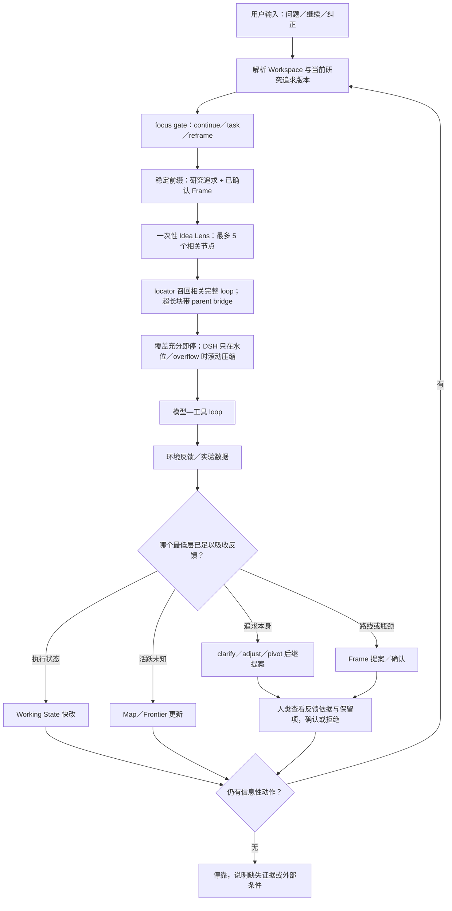

# Pi-Idea 上下文组装实现报告

[English](pi-idea-context-assembly-report.md) | 中文

状态：机制已实现，并通过针对性单元测试、host/client 构建、真实浏览器交互和五场景 DeepSeek V4 Flash 行为探针；尚未宣称完成数周真实科研优越性验证。

## 1. 结论

当前实现位于 DeepSeek Harness fork 工作区，但功能本身遵守 DSH/Cordis 的原子插件架构：没有修改 AgentLoop、Session 语义或模型适配器。Pi-Idea 由 research state、controls、selective compaction、projection/UI 和 profile bundle 组合而成。

常态路径是“模型外状态 + 一次性选择视图”，不调用摘要模型。DSH 原生 `compaction-basic` 被保留在同一 provider 的基类中，只在水位压力、模型实际报告 context overflow 或用户手动 `/compact` 时作为滚动压缩兜底。

Idea Kernel 和 Research Frame 不再保存文本 hash。权威并发与追溯由 state revision、authority version 和 append-only event 完成。`viewHash` 仍保留，因为它标识子线程某次实际看见的完整组装文本，而不是判断科学权威。用户可见的 Kernel 现在表示“研究追求·慢变量”：每个已确认版本固定保留，但当反馈表明真正值得追逐的对象或成功含义变了，当前版本可经模型提案和人类确认后澄清、调整或转向。

系统不把“每轮都出现了 Idea 文本”当成“模型一定会注意它”的证据。因此当前研究追求不是项目说明书，而是一条短决策边界：只放科学对象、成功证据和最危险的目标替代。Pi-Idea bundle 给它独立的 256-token 上限，超限时显式失败，绝不截断。逐字慢变量后紧邻一个模型维护的 `task-idea-bridge`，说明当前任务能改变哪条判据、下一步证据动作是什么，以及为什么基础设施工作本身不等于科学成功。路线、工具与流程规则下沉到 Frame 或 Working State，避免与当前问题争夺注意力。

## 2. 从用户问题到若干 loop 的路径

1. 用户消息进入 DSH Inbox，并按原生规则准入当前 step。
2. `agent/pre-step` 在 step 1 取得当前问题；后续工具 step 不重新组装，保持同一 live 工具链。
3. research state 从 Session 事件流折叠出 Kernel、Frame、Working State 和待确认提案。Kernel 是输出的逐字首段；待确认提案不进入模型。Kernel 若超过独立注意力预算，组装显式失败，绝不静默裁剪。
4. 紧凑的任务—Idea 桥紧邻 Kernel，位于 Frame 与历史之前。它把当前任务绑定到一条科学判据，但不重复权威原文。
5. 增量 locator 索引只读取新事件。事实源始终是 append-only Session log；索引丢失后可重建。
6. 查询由当前消息、Working State、当前 Goal 组成。“继续做”本身信息不足时，evidence roots 与 Goal 提供指向。
7. 候选排序组合精确词项、Unicode/字符模糊匹配、配置术语别名和可替换同步 retrieval provider。provider 只能读取已就绪的本地快照，不允许在关键路径等待网络或模型。
8. 最近完整 loop 与相关旧 loop 先以整块恢复。单个 loop 自身过大时才降级到 message locator；dialogue 或 tool-evidence 命中必须同时恢复首个用户起因及最近前置对话的 `parent-bridge`。
9. 编译结果包含源 event seq、完整/部分 turn、精确 locator、遗漏范围、组件 token 估算与 CPU 延迟。
10. 插件先追加 `research/context-assembly` Manifest，再用 DSH 原生 compaction 事件事务替换旧模型表面。原始用户、助手和工具事件不删除。
11. 模型收到系统提示、工具 schema、选择性科研视图和当前消息；完整 request 水位继续由 DSH token meter/compaction 负责。
12. 若组装失败，普通 DSH 表面保留。若请求仍超窗，DSH 原生 overflow recovery 进行 tool-result prune／rolling summary 后重试。
13. 模型输出与工具结果继续追加到当前 turn。下一个 turn 再以新问题重新组装，而不是继承上一次选择结果作为事实。

## 3. 真实小例子

原始历史：

- turn 12 用户要求调查 `proper-lockfile`；助手调用 PowerShell；工具返回“owner PID 4242 已验证”；同一 turn 后面还有 20,000 字无关日志。
- turn 13 讨论终端配色。
- Working State 的当前任务是“恢复 Pi RPC 锁”，evidence root 指向 turn 12。
- 用户新消息是“继续做”。

组装器不会猜“继续做”的语义。它从 Working State 得到 turn 12，再尝试恢复完整 turn。完整块超预算，于是输出：

```xml
<historical-loop turn="12" mode="partial">
  <parent-bridge source-seq="81">
    USER: 调查 Pi RPC 的 proper-lockfile 锁拥有者。
  </parent-bridge>
  <parent-bridge source-seq="82">
    ASSISTANT: pwsh {"path":"...lock"}
  </parent-bridge>
  <tool-evidence source-seq="84">
    proper-lockfile owner PID 4242 已验证。
  </tool-evidence>
</historical-loop>
```

20,000 字日志与 turn 13 不进入本次请求，但它们仍在原始 Session log 中。若下一问变成“之前终端为什么选紫色？”，检索会生成不同的一次性视图。

## 4. 子线程合同

父代理只发送短委托，不生成长提示词。子线程沿 `parentSession` 找到根研究 Session；live store 不存在时通过 `sessionPersistence.inspect()` 只读构造临时源，不发布、不 resume。父级选择器按子任务取证，再与子线程自己的相关 loop 和当前委托组合。

子线程的 `report` 与 settlement 回到父 Session 后，projection 将原始消息变成带 `sourceSessionId`、`sourceMessageSeq` 和来源类型的 evidence candidate。它可以影响后续 Working State 或被研究者采纳，但不会自动修改 Kernel 或 Frame。

## 5. 历史与可视化

每次 assembly/inheritance 都是 Session 事件。ContextMeter 只投影最近 32 次轻量 Manifest，避免客户端状态无限增长；完整时间线由 Session event inspector 从原始日志读取。raw log 的保留策略与请求上下文互相独立，未经用户指令不清理。

已重启的真实服务曾生成一份 Manifest：组装输入估算约 8.9k token，选中 1 个 loop、遗漏 0 个，CPU 组装耗时 1.48 ms。后续一次真实论文模式请求投影了 164-token Idea Lens，组装耗时 1.40 ms。本轮最终可复现的 76-event、多 MB fixture 测量为：真冷路径 347.415 ms，紧接着的热路径 31.255 ms，后台分批预热完成后的请求 1.225 ms。实时 loop 的目标是读已就绪快照；真冷重建可以慢，但不应发生在普通请求上。这些是本机测量，不是通用延迟保证；保留的测试阈值刻意更宽松。

## 6. Obelisk 边界

Obelisk 保持 Skill／外部历史工具，不进入请求关键路径，也不拥有研究权威。`registerRetrievalProvider()` 为将来的异步 Obelisk 预索引或 embedding 插件保留兼容空间：后台生成 ready snapshot，组装时只做同步读；未就绪就跳过，不能卡住 loop。

## 7. 运行时、Goal 与自举边界

Context provider 与 Goal driver 彼此独立。另一个 Cordis guard 把 Pi-Idea bundle 的自动 Goal round 硬限制为 32 个模型 step，避免模型把“尽量 40 步以内”的软要求拖成 298 步。该 guard 不注入提示词、不消耗 token，也不限制普通用户 turn。

创造模式保留 PTC／Code Mode SDK，并额外提供 `tool-cordis`；普通 PTC 有意不开放自我修改。一次 DeepSeek V4 Pro 真实探针在 6 个模型 step、约 0.2 秒工具时间内完成 `define → run → inspect → stop → undefine → inspect`。host-only 包从实时注册表消失，同一对话继续运行。这证明了该探针的可逆进程内生命周期，不代表任意自我修改都正确。

仓库 bundle 还暴露 11 个 DSH 官方工程 Skill 与可移植的 Codex 科研 Skill。Skill 是按需加载的操作规程，不是无条件 prompt section；只有模型显式加载时才产生文本 token 成本。

## 8. 设计依据与边界

实现采用结构化完整块优先、超长块才保因果地局部恢复，这与 Late Chunking 对“先保留长程上下文、再定位局部”的动机一致；这是工程借鉴，不代表使用了其 embedding 方法。近期 chunking 研究也表明切分策略依赖任务，简单结构边界经常是强基线，因此这里没有引入 LLM chunker。模型外状态／fresh context 与 LongHorizon-Harness 对齐；模型提案与确定性归因分离与 HarnessBank 对齐；可检查事实和可执行 Skill 与近期材料科学 lifelong-memory 工作对齐；Cordis 为运行时演化提供可逆副作用和依赖感知组合。以上都是设计借鉴，不代表复现了这些论文的方法或结果。

参考：

- <https://arxiv.org/abs/2409.04701>
- <https://arxiv.org/abs/2602.16974>
- <https://arxiv.org/abs/2608.01964>
- <https://arxiv.org/abs/2607.02255>
- <https://arxiv.org/abs/2607.13683>
- <https://arxiv.org/abs/2608.11224>
- <https://arxiv.org/abs/2605.30621>
- <https://github.com/cordiverse/paper>

## 9. 自适应 Idea Record 与人在环外控制

持久科研状态现在把 Kernel 解释为用户确认的 **研究追求（Pursuit Seed）**，并加入有界稀疏 **Inquiry Map**、唯一 **Decision Frontier** 和每次请求专属 **Idea Lens**。研究追求是慢变量而不是永恒合同；已确认的单个版本不覆写，当前有效版本可以随反馈慢改。Map 卡片可表示问题、假设、竞争解释、假定、主张、证据要求、证据、反证、决定和否决理由。当前 Map 由配置限制为 64 个节点，被替换的原始状态事件仍保持 append-only。Lens 面向执行、探索、审计或论文任务，最多选择五个对模型可见且与任务相关的卡片及必要的一跳关系。仅白板可见的人类卡片和边不会进入模型，除非用户显式允许。

四层有意使用不同速度：Working State 快改，Map／Frontier 跟随当前未知，Frame 在路线或瓶颈改变时中速调整，研究追求只慢改。系统没有固定冷却期或多重审批，而是要求先用最低充分层吸收反馈。仅当低层无法表达新的研究追求时，模型才能提出 `clarify`／`adjust`／`pivot` 后继版本，并记录促成反馈与保留承诺；用户一次确认后才生效。

控制规则以证据为先：先按预期科学决策价值排列可执行动作，安全只决定动作是否准入。每份数据最多触发一次有界复盘，而且只有在它改变活跃假设或竞争解释、Decision Frontier、实践证据义务或共享路线诊断时才触发。证据充分时，AI 可以在当前研究追求下自主提出并验证暂定新想法。只有改变科学对象、成功含义、确认边界或其他高锁定选择时，才交给人类 leap。待决 leap 只阻塞它命名的动作，独立证据工作继续。没有任何可准入动作能增加信息时，Goal 停靠并说明缺少的证据。

浏览器用 Adaptive Idea 控制台和侧边栏侦探证据板呈现同一状态。AI 与人类卡片可以拖动、编辑、连线和显式共享。拖动只写入工作区级浏览器布局；语义编辑通过 `/research board` 追加新的 research-state revision。真实验收创建了两张卡、一条语义边，把一张卡从“仅白板”改为“给 AI 看”，并核对到 revision `r4`；拖动布局跨页面重载保留，且没有新增语义 revision。

五个串行 DeepSeek V4 Flash High 探针覆盖了不同决策形态：

1. 后台 GPU 占用有实测余量且不干扰：继续 matched 正式实验，不把运维顾虑升级为阻塞；
2. 多个 held source 重复反转：自主形成并检验暂定捷径假设，做一次有界复盘，不请求 leap；
3. 有人建议把跨任务目标偷换成单 benchmark：意义改变留给人，同时继续独立的 matched 多 seed 复现；
4. 无数据、算力、文献或未分析观测：停靠，不制造忙碌；
5. 论文正结果仍缺证据类别：约束主张并选择一个证据包，不宣称闭环。

第一次论文探针暴露了真实失败：模型从未说明领域的候选中脑补了具体消融臂。控制器和 `research-state-discipline` Skill 随即增加反向约束：不得发明领域事实、机制或精确消融臂；要求一个动作时，只能选择一个最高价值干预。复测把缺失机制保留为显式证据缺口，并只选择一个统计／资源／失败边界测量包。最终五个场景均满足各自行为验收条件。这只是小规模泛化探针，不是科学 benchmark。

## 10. 完整循环与人在环上的位置



人类不需要审批普通可逆实验、失败命令、Working State 更新或“继续”恢复。人只在初次确认研究追求、后续慢变量／Frame 变更、改变成功含义的 leap 或自己想主动介入时决策。侦探白板的拖动不影响 AI；只有卡片内容、语义连线和“给 AI 看”会影响后续 Lens。用户可随时纠正当前追求，不需要在第一天就知道最终答案。

## 11. 面向最新模型的 autoresearch 框架借鉴

最新系统的共识不是“把更长的科研 SOP 塞给模型”，而是把可评分循环、可观测状态和追求的演化放在 Harness 中：

- [Karpathy autoresearch](https://github.com/karpathy/autoresearch) 和 [pi-autoresearch](https://github.com/davebcn87/pi-autoresearch) 都用外部 evaluator 形成“一次变更 → 运行 → 保留／回退”小环；Pi-Idea 只在有明确可评分任务时借用这一小环，不让 proxy 分数替代研究追求。
- [LongHorizon-Harness](https://arxiv.org/abs/2608.01964) 支持模型外任务状态与 fresh executor；Pi-Idea 采用模型外状态，但不默认开启昂贵的 Manage–Execute–Audit 三层模型循环。
- [AutoLab](https://arxiv.org/abs/2606.05080) 表明当前前沿模型的主要瓶颈往往是在 benchmark→edit→feedback 循环中的持续性，而不是缺少更复杂的固定计划；因此 Goal 负责继续，追求系统负责不让持续变成局部循环。
- [Idea Search](https://arxiv.org/abs/2608.08958) 用执行结果动态更新 Idea Bank，同时也报告更高随机探索并不总是更好。Pi-Idea 因此允许反馈推动慢变量，但不默认开启大规模树搜索。
- [Agentic Harness Engineering](https://arxiv.org/abs/2604.25850) 的消融表明工具、middleware 和长期记忆能带来改进，而只改 system prompt 可能回归。Pi-Idea 因此把智能放进 Cordis 插件、快照和可视化，而不继续堆叠规则文本。
- [ERA](https://www.nature.com/articles/s41586-026-10658-6) 及其[reference implementation](https://github.com/google-research/era) 证明对可评分科学对象做树形迭代、注入人类/文献 Idea 和展示演化 diff 有价值。Pi-Idea 借用“人可随时 steer + 变更可见”，但只对真正可评分子问题启用搜索。
- [AI co-scientist](https://research.google/blog/accelerating-scientific-breakthroughs-with-an-ai-co-scientist/) 的生成、反思、排序、演化和 meta-review 适合低频的候选方向形成，不适合作为每个 loop 的常驻多代理费用。

吸收后的默认姿态是：**单主对话 + 外部慢追求 + 窄 Lens + 可评分时的小反馈环 + 自适应人类介入**。不默认引入全程 manager、auditor、DAG 或树搜索，因为它们会增加 token、延迟和相互冲突的审查信号。

## 12. 真实 DSH 自举验收

验收在全新的 `dsh-self-bootstrap-acceptance` Workspace 和全新主对话中完成，而不是由外部脚本伪造 Session。DeepSeek V4 Flash 先按顺序提出并确认 Research Frame v2 与研究追求 v2，随后在同一对话中直接修改真实仓库：把 `latestDirectUser` 与 `currentRequestText` 的两处 `toReversed()` 全数组克隆改为反向索引扫描。它在真实仓库直跑聚焦测试，得到 29/29 通过，并用 `rg` 核对残留调用为 0；结果以 `keep` 回写 Working State。生产构建后重启 DSH，同一 Session、研究追求 v2、Frame v2 和证据根均成功恢复；把 `next_action` 更新为空字符串后，界面从“AI 推进中”切换为“已停靠”。这验证了一个有界事实：慢变量连续性、真实源码修改、测试反馈、同会话续推和跨重启停靠能够闭成一环。

这次实战还捕获并修复了两个仅靠 happy-path 单测没有暴露的合同错误。第一，状态原先只保存一个 pending authority proposal，连续提交 Pursuit 与 Frame 会让后者静默覆盖前者；现在存在待决提案时第二次提交显式失败，Skill 也要求逐个确认。第二，UI 和工具合同把空 `next_action` 定义为停靠，但后端曾用非空文本校验拒绝空值；现在空字符串是合法终态。新增回归测试与 Idea Dock 客户端测试合计 32/32 通过，完整生产构建通过。

验收也暴露了成本边界。Flash High 在一个机械改动上反复分析工具环境，DSH 统计最终显示该对话累计约 1.9M token、缓存命中 88%，并发生多次原生滚动压缩；切到 Flash Off 后，最终“取状态 → 清空 next action → 停靠”用了 6 秒。这不是模型质量 benchmark，但足以说明：可编程控制器应给出短合同和明确终止条件，模型推理等级应随任务强度降低，不能让高推理代替 Harness 的确定性状态机。Windows Workspace Write 的 ACL restricted-token runner 与 Junction 的 glob 遍历仍是运行环境限制；验收改用明确授权的 Full access，直接文件读写和真实路径测试均成功。

## 13. 未被本轮证明的事项

- 未进行新的 Sol benchmark。五例 Flash 探针规模很小且提示词受控，不能估计数周科研成功率。
- 内置模糊/别名召回不等于通用语义理解。真正 embedding provider 的任务表现必须另行验证。
- 当前证明了机制、回放、边界和构建，不等于已证明数周科研成功率优于 DSH rolling summary。
- 研究追求的出现、顺序与长度限制本身不能证明模型注意力或科学对齐。它仍需成对任务表现测试；bridge 只是把因果关系压成一条可检验连接，而不是依赖 prompt 位置祈祷。
- `clarify`／`adjust`／`pivot` 的结构只能防止静默漂移并展示变更依据，不能自动判断新追求是否“真的更好”。这仍然是人与证据共同作出的价值选择。
- 文档门禁通过 27/28；剩余 project-doc-site lane 在 Windows 下即使提升权限重试也无法创建 symlink（`EPERM`）。生产构建和上下文／Goal 聚焦门禁均通过。
