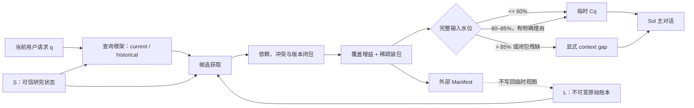

# Pi-Idea 最终上下文组装方案：LSC-EPC

状态：`DESIGN FROZEN / AUTHORITY-V4 CPU IMPLEMENTED / MODEL ADOPTION NOT PASSED`
日期：2026-08-13
方案名：`LSC-EPC`（Ledger–State–Context Evidence-Preserving Compiler）

> 本文冻结的是 Pi-Idea 的长期记忆与上下文组装架构，不改写权威 `IDEA.md`。本轮用户明确确认的目标高于旧文档；实质性研究意图变化仍只能经过“候选差异 -> 用户确认 -> 新版本”。

## 1. 冻结的产品目标

Pi-Idea 要成为一个以 `gpt-5.6-sol` 为主对话核心、推理等级不被架构限制的长期科研伙伴。它需要连续数周推进研究，同时解决三个相互关联的问题：

1. 单一超长对话会逐渐占满上下文并降低模型表现；
2. 新开对话能恢复模型状态，却会丢失项目连续性；
3. 局部工程任务和最近信息会逐渐覆盖最初研究意图，造成目标漂移。

解决办法不是把全部历史交给 Sol，也不是把历史不断压成一份总摘要，而是把完整历史留在模型外，由确定性的上下文组装器为每次调用构造当前任务所需的工作视图。

优化顺序严格为：

\[
\text{任务表现与关键约束} \succ
\text{输入 token} \succ
\text{CPU 组装延迟}
\]

只有前一项不退化，后一项才有优化资格。“最小充分上下文”是方向，不声称运行时能求出数学上的最小集合。

“无限记忆”在这里仅表示 raw 默认在模型外长期保存、可追溯并可重新组装；它不表示单次注意力无限，也不承诺检索永远不漏。容量不是当前优化目标：100 GiB 以前不主动清理，超过 100 GiB 也只触发容量复核，任何 raw 删除仍需用户明确授权。

当前范围只做主对话的正常上下文组装。Luna 工具线程、自适应 effort、第三层 loop 和多角色执行器全部延期，不进入本方案的关键路径。

## 2. 核心抽象：History、State、Context 不再混为一体

### 2.1 L：默认永久的不可变事件账本（Ledger）

`L` 保存 Pi 原始 session event、用户输入、助手公开输出、工具调用和工具结果，并保留 session、entry、parent、时间、分支和恢复地址。raw 不因低热度、年龄或本轮未命中而删除；清理只能由用户明确发起。

账本是**来源记录**，不是“里面每句话都是真的”。用户表达拥有规范性权威，文件、工具和实验结果拥有经验性证据权威，助手旧结论只是一条带来源的历史陈述。任何派生摘要、标签或排序都不能覆盖原始记录。

### 2.2 S：窄而可信的研究状态（State）

`S` 不是对历史的自由文本总结，而是可验证事件的确定性归约：

\[
S_t = \operatorname{Reduce}(S_{t-1}, e_t^{verified})
\]

当前生产实现故意保持很窄，只包括：

- 用户确认的 Idea 内容、版本、哈希和确认时间；
- 用户显式设置的当前 stage；
- 当前 session、branch 和 active entry 坐标；
- 尚未完成的 provider transaction 等可确定状态。

当前实现**不会**把模型摘要、旧助手判断或自动抽取的“研究结论”升级为 `S`。以后若加入更丰富的原子状态，必须有原始证据引用、状态键、版本、验证方式和可回滚记录。

### 2.3 C：任务条件化的临时上下文（Context）

每一轮只生成一次临时视图：

\[
V_q = \operatorname{View}(q, S_t, L_t)
\]

\[
C_q = \operatorname{Compose}
\bigl(
\operatorname{Intent}(S_t),
\operatorname{Closure}(V_q),
\operatorname{LiveTail}
\bigr)
\]

`C_q` 只服务当前调用，用后丢弃，绝不写回 `L` 或直接改写 `S`。只有真实新事件可以追加到 `L`，只有用户确认或经明确验证的状态事件可以改变 `S`。这条单向数据流阻止“模型用自己上一轮的压缩结果继续压缩自己”。

## 3. 总体数据流



这不是三级 agent loop。外部存储、检索、闭包和装包只是同一个确定性 Workflow 内的编译阶段；Sol 仍是唯一科研对话与路线判断核心。

## 4. 从前沿研究继承了什么，又拒绝了什么

### 4.1 LongHorizon-Harness：最契合的是 State，不是三角色外形

[LongHorizon-Harness](https://arxiv.org/html/2608.01964v1) 把长程执行重写为显式任务状态管理：manager 持有原始目标与任务状态，executor 每轮使用新鲜上下文，auditor 只读检查，只有审计后的发现才能更新跨轮状态。其[官方实现](https://github.com/AMAP-ML/LongHorizon-Harness)也明确把 executor 的长轨迹与跨轮 task state 分开。

Pi-Idea 直接继承：

- 原始目标与当前执行状态分离；
- 每轮重建新鲜、任务相关的工作上下文；
- 未验证输出不能自动升级为长期状态；
- 长任务按可审计状态前进，而不是依赖模型记住完整轨迹。

但当前不照搬它的 MEA 三角色循环：

- 科研对话的 raw trajectory 不能被丢弃；错误、否决和条件常常是未来证据；
- manager 生成的自由文本 task state 不能成为唯一长期真值；
- auditor 会显著增加 token 和调用复杂度，不能在没有 Pi 实测失败前默认加入；
- 它验证的是长程执行 harness，不是多周科研对话的上下文编译器。

因此 Pi-Idea 的改进是：`L` 永久保存原始轨迹，`S` 只保存窄而可验证的状态，`C` 才是每轮可丢弃工作区。

### 4.2 MAGE、IterResearch、RaMem 与 MemPrism

- [MAGE](https://arxiv.org/html/2606.06090v1) 的层级 execution-state tree 和 root-to-current active path 支持 Pi-Idea 的 active branch、依赖闭包与局部分支隔离；其压缩/修订操作不能取代 raw ledger。
- [IterResearch](https://arxiv.org/html/2511.07327v2) 每轮由问题、演化报告和最近动作重建有限 workspace，证明“重建而非追加”可以扩展到很长的交互；Pi-Idea 接受 workspace reconstruction，但拒绝把演化报告当作唯一事实源。
- [RaMem](https://arxiv.org/html/2606.22844v1) 指出相关但属于错误 session/状态的记忆会造成 context collapse，支持 evidence anchoring、recall-condition induction 和 validity-aware ranking。Pi-Idea 因而把 Idea/stage/session 坐标绑定在事件发生时，而不是检索时事后贴标签。
- [MemPrism](https://arxiv.org/html/2608.06745v1) 把持久事件流与任务条件化临时 view 分离，并强调临时 view 不写回记忆；这正是 `L -> View -> C` 的直接来源。
- [Verifiable Memory](https://arxiv.org/html/2608.03137v1) 强化了“长期记忆写入必须可验证、可追溯”的方向；当前实现先采取更保守的做法：不自动写入经验性 state。
- [PM-Bench](https://arxiv.org/html/2607.12385) 表明更多提醒或更复杂 scaffold 并非普遍更好，因此本方案不因流行而默认增加工具线程或多 agent 层。

这些结果来自各自 benchmark 或新近预印本，是架构证据，不是 Pi-Idea 已达到论文数字的证明。

## 5. 原始记忆与状态坐标

### 5.1 项目隔离与恢复

每个规范化工作区映射到独立 `project_id`。Pi session 是默认永久的 cold raw truth；项目级 SQLite/FTS 是可重建 warm index；当前会话增量是 hot state。新对话从项目 capsule 恢复最新用户确认 Idea/stage，再从旧 session 逐字回取证据。Pi-Idea 不创建第二份无界“权威 raw 账本”，也不自动删除 Pi session raw。

### 5.2 事件发生时绑定坐标

每个 raw block 除来源字段外，还保存：

```text
research_idea_hash
research_idea_version
research_stage_hash
session_id / entry_id / parent_entry_id / entry_timestamp
recoverable_ref / raw_hash
```

状态事件按原始顺序 replay。一个旧消息保留它产生时的 Idea/stage，后续 stage 变化不能回写污染旧证据。旧数据库在升级后通过 raw session replay 回填缺失坐标；block id 和 FTS row 不重复创建。

### 5.3 分支与权威

- active branch 参与默认检索；废弃分支仍保留在 raw ledger，可在明确历史/审计请求中恢复；
- user、tool/file/experiment、assistant 的 authority 分开记录；
- 词法相关性只能排序，不能把旧助手判断变成测量事实；
- context mismatch 只降权，不删除历史。

### 5.4 保留与清理合同

- raw 默认永久保存；100 GiB 只是容量复核线，不是删除授权；
- 生产 loop 不安排自动清理；`cleanupIfDue` 明确返回 `automatic-cleanup-disabled`；
- 显式清理工具默认只做 dry-run，真实执行需要独立 `authorized=true`；
- 即使用户授权清理可重建索引块，也保护 pin、unresolved、最近 session、近期访问块及其依赖闭包；
- 只有 recovery source 文件仍存在的缓存块才进入候选；删除后校验候选确实消失、保护样本仍存在；
- `UNKNOWN` 表示本轮未注入，不能作为 raw 删除理由。

## 6. 单轮 LSC-EPC 编译算法

### 6.0 切分单位：每个 loop 一到两个 assembly island

Pi 的 user entry 开启一个 `loop_id`，直到下一条 user entry 前都属于同一 loop。每个 loop 最多生成两个逻辑块：

1. `dialogue`：用户输入与助手对用户可见的 public/final 文本；
2. `tool-evidence`：工具或 shell 的原始结果。

assistant thinking、UI 状态、tool call 参数和 shell command 仍在 raw/provenance 中，但不是可渲染事实。长消息可以按段落、换行、句末、空白、硬切片顺序建立**内部 locator**；目标 384 tokens、硬上限 768、零 overlap，并保存 `char_start/char_end/raw_hash`。locator 只帮助命中：任何一个片段被选中后，编译器按 `(loop_id, slice_type)` 恢复完整 island。强制硬切片必须恢复整个原始事件；整岛超过预算就产生 gap，不能把孤立片段当完整事实。

生产摄取由单个 worker thread 串行完成，每批 8 entries。主 loop 只把增量 post 给 worker 并读取最后一次已提交的 WAL snapshot，不等待切段、写索引或 checkpoint。

### 6.1 查询框架

先判断本轮是默认的 `current` recall，还是用户显式询问“之前、旧值、当时、previous、history”等的 `historical` recall。

- `current`：相同 Idea 和 stage 的候选获得 context compatibility 增益，错误 Idea/stage 候选降权；
- `historical`：关闭当前状态偏置，让显式旧版本查询可以正常回取旧证据；
- 该判断不删除任何 block，且写入 Manifest。

这不是完善的语义意图分类器，而是确定性、可测试的第一道 context-collapse 防线。模糊表达仍可能需要用户澄清或更宽 raw lookup。

### 6.2 多路径候选获取

项目检索并行概念、串行执行地形成三个候选池：

1. active stage 内的 FTS 命中；
2. active Idea 内的 FTS 命中；
3. project-global FTS/LIKE fallback。

随后按 block id 去重。精确 evidence ID、路径、符号、数字和自然文本优先；中文使用字符二元组，英文/路径使用规范化词项。FTS 已返回证据时不再做 LIKE 全表扫描；只有 FTS 零命中才进入兼容 fallback。候选池最多默认返回 24 个 locator，再映射到 loop/island，最终装包保持稀疏。

### 6.3 类型化与结构去冗余

Pi message 按 user text、assistant public/final、tool call、tool result 等类型记录为不可变 raw block，再映射为 loop island。tool call 保留在 raw 和 call/result provenance 中，但 `fact_candidate=false`，不会渲染给 Sol。只有可证明规则可以签发本轮 DROP certificate，例如：

- 同一 source identity 与 raw hash 的重复摄取；
- 显式排除的 UI/非语义噪声；
- 被完整最终流覆盖的中间 fragment；
- 在同一 state key 上被显式新版本 supersede 的旧状态。

年龄、低相似度、低热度、模型判断“不重要”或摘要未提到，均不能单独触发 DROP。`UNKNOWN/DEFER` 只表示本轮未注入，不等于无关或可删除。

### 6.4 Roots 与依赖闭包

强制 roots 包括：

- 当前用户确认的 Intent/Idea 和 stage；
- 最近自然语言事务；
- fresh/unresolved block；
- 最新未闭合 tool call/result；
- 用户点名的 evidence、文件、符号、实验或旧状态；
- 高置信多词命中与精确引用。

从 roots 做有界闭包，首先恢复同一 `(loop_id, slice_type)` 的完整 island，再保持显式依赖、冲突、验证、supersession 与 call/result provenance。tool call 本身不渲染；tool result 只在 tool-evidence island 被命中或成为必要证据时进入。强依赖宁可保留较大的 dependency island，也不抽出一条失去条件的孤立结论。

### 6.7 Obelisk 兼容层

Obelisk 不介入 hot path，也不替代 SQLite/FTS。只有 manifest 出现 `memory-request-without-confident-root` 时才生成一次 bounded lookup plan。兼容层最多接受 8 条 `contentType=text`、非 meta、非 truncated、带稳定 session/message ID 且 SHA-256 匹配的逐字文本，再适配为外部 raw evidence block。Obelisk 的 summary、thinking、聚合计数和截断 snippet 均不能直接成为 Sol 证据。

### 6.8 为什么默认不用小模型切段

当前默认使用事件类型、user 边界和确定性自然边界。SaT/wtpsplit 可以作为未来异步 boundary proposer，但不得决定 KEEP/DROP，也不能进入 loop；建议只缓存 `raw_hash -> boundary offsets`。在 EqOp 派生回归上证明任务表现收益前不开启，因为语义切块并不稳定优于简单切块，而 0.2B 级 SaT 也没有证明能满足本机 10 ms hot-path 预算。内部 locator 已经不影响最终 assembly island，因此小模型的潜在收益进一步缩小。

### 6.5 覆盖增益与停止规则

强制闭包先装入。每个可选候选只有在满足以下至少一项时才能进入：

- 覆盖尚未覆盖的查询词项或精确引用；
- 是已选 root 的必要依赖/冲突/版本关系；
- 用户明确要求查看。

当没有新的边际覆盖时立即停止，绝不因为仍有 token 预算就加入更多 UNKNOWN。生产默认只允许少量高置信 roots 与可选 roots；这两个数量是安全上限，不是要填满的 `top-k`。

### 6.6 渲染与 provider 边界

发送给 Sol 的顺序为：

1. 当前确认 Idea 逐字位于 anchor 开头；
2. 带 Idea/stage hash 和版本的 verified research state；
3. 若存在则显式 context gap；
4. 按账本顺序渲染的逐字 evidence blocks，附短 session/entry/Idea/stage 坐标；
5. 最近完整自然语言事务与当前请求。

只用于组装的内部坐标在发送 provider 前从原始 message 字段剥离；必要 provenance 以受控 evidence wrapper 呈现。完整 Manifest、长恢复地址和 DROP certificate 留在模型外。

## 7. Token 水位

令 `W` 为 Pi 当前 runtime model metadata 报告的 context window。生产规则为：

\[
soft = \lfloor 0.60W \rfloor, \qquad
hard = \lfloor 0.85W \rfloor
\]

- `< 60%`：正常区；
- `60–85%`：只允许完整 mandatory closure 有明确扩张理由时进入；
- `> 85%`：死线，不发送残缺 evidence，改为显式 gap 或拆分任务。

15% 是响应 headroom。模型目录中的 `max output tokens` 是能力上限，不是每一轮都必须从输入窗口中再次扣除的固定预留；否则本地 Pi 所报 272k window 与 128k max output 会把实际硬线错误压到约 53%。

完整输入估计当前包括 system prompt、固定 tool-schema reserve、Intent anchor、live turns、evidence wrapper 和 current request。tool schema 目前用保守固定 reserve，而非 provider 精确 tokenizer；这是尚待在线 usage 校准的工程误差，不应宣称为精确计数。

Pi 0.84.1 本地 catalog 当前报告 Sol/Luna `W=272,000`，所以软线为 163,200，硬线为 231,200。公开 API 页面与本地 Pi provider metadata 不混用；运行时始终以后者为准。

## 8. 摘要政策

默认关键路径不调用模型总结，也不把总结注入 Sol。

若未来确需导航卡，只允许：

- 对稳定、不可变 raw span 一次生成；
- 保存 source block ids、raw hashes、generator 与时间；
- 禁止 summary-of-summary；
- 只能扩展检索候选，不能成为事实、Intent 或 State；
- 命中后必须回取逐字 raw evidence；
- 原文缺失或 hash 不符立即失效。

优先级始终是：结构去重与显式 supersession > raw 检索 > 依赖闭包 > 确定性 excerpt > 可丢弃导航卡。

## 9. Manifest 与可重放性

每轮模型外记录至少包括：

```text
project / session / idea version and hash / stage hash
compiler version / query hash / input event digest
recall mode and contextual-ranking switch
roots and reasons
retained / dropped certificates / deferred UNKNOWN
coverage and stop reason
gaps and requested bounded raw lookup
context window / soft / hard / response headroom
system / tool reserve / anchor / live / evidence token estimate
output hash / CPU assembly latency
```

因此可以回答：Sol 这一轮看到了什么、为什么看到、哪些内容只是未选而非删除、是否跨过软线、以及如何从 raw ledger 重建同一结果。

## 10. 已实现的代码闭环

当前代码已经完成：

- Pi 0.84.1 项目本地恢复，默认启动 `openai-codex/gpt-5.6-sol`，reasoning 可由用户选择；
- `context` hook 中的 LSC-EPC 实现，以及固定门失败后的默认 safe/no-removal 交付路径；
- 真实 Pi SessionEntry provenance 与事件时 Idea/stage 坐标；
- 工作区隔离的 SQLite/FTS raw block index 与跨 session capsule；
- 带 version/parent hash 的用户确认窄状态；显式 unset 只改变当前 view，不删除 raw 事件；
- 后台持久 continuation/evidence frame；裸“继续”按 Idea/stage 坐标恢复上一完整 loop 与已用证据；
- 每个 loop 的 `dialogue` / `tool-evidence` 一到两个 assembly island，locator 命中后恢复完整岛；
- tool call 参数从 Sol context 排除，tool result 作为独立证据岛保留；
- 单 worker thread、8-entry yielding ingestion，主 loop 零等待读取最后提交快照；
- active-stage、active-Idea、global 三路候选获取；
- current/historical recall guard 与 context-validity ranking；
- 三态 `MATERIALIZED / LOCATOR_ONLY / EXCLUDED`、KEEP 优先、依赖闭包、覆盖停止和 hard-gap；raw 不因本轮选择而物理删除；
- authority update/scope bridge、更新事件的窄投影和 supersession shadow；
- 可选同步 decision-forest soft-candidate reranker；不能压制 hard authority roots，默认关闭；
- 60%/85% 水位、15% response headroom 和 Manifest；
- 旧索引坐标的 replay/backfill；
- 默认零模型、零摘要、CPU-only；选择性删除默认关闭。

尚未实现、且当前不应假装已经完成：

- 自动把实验结论写入丰富 `S` 的 verifier；
- 针对模糊历史意图的高召回语义检索或 reranker；
- LongHorizon-Harness 式 manager/executor/auditor 三角色循环；
- Luna 工具线程或自适应 effort executor；
- provider usage 对 token estimator 的在线校准；
- 通过任务表现门的选择性压缩策略（当前候选已验证失败）。

## 11. 2026-08-13 可复现验证

### 11.1 实现与集成门

- 扩展全量测试：78/78 通过；
- Pi RPC smoke：扩展加载、命令注册与 `/idea-propose` 通过，零模型调用；
- 项目本地安装 smoke：Pi package 与扩展加载通过；
- 切分、worker、项目记忆、EqOp 约束、预算合同与 Obelisk 兼容层均包含确定性回归；
- 全 benchmark tests：85/90 通过；其余 5 项仅因 CAME、GaRAGe、MemoryArena 的第三方数据未安装而 ENOENT，非代码断言失败。按本轮“只做固定 5% MemSyco”范围，不下载这些额外大数据集。

### 11.2 Context-reinstatement CPU 诊断

80 个确定性 synthetic cases，零模型、零 GPU：

| 条件 | current 选择正确率 | current distractor@1 | historical 正确率 | current mean tokens | current p95 CPU |
|---|---:|---:|---:|---:|---:|
| 仅词法 | 50% | 50% | 100% | 62.68 | 0.133 ms |
| Idea/stage contextual reinstatement | 100% | 0% | 100% | 62.85 | 0.263 ms |

这证明实现能解决**构造出的同词异状态检索冲突**，并且历史查询 guard 没有被当前状态偏置破坏。它不证明真实科研任务从 50% 提升到 100%，也不是端到端模型表现。

### 11.3 固定 5% MemSyco assembly-only pilot

- 官方数据 1,550 条，固定分层 5% = 78 条；
- dataset digest：`sha256:2f4153d11a2cf4bd05b919d6e01adabdbe3cb695729adfbab2938f02dd37cecb`；
- 固定 8192-token 组装预算，五个条件均 78/78 无 overflow；
- raw mean context = 2054.59 tokens；
- production loop-island v3 `bidirectional-heat` mean context = 1582.03 tokens；
- 在这套组装表示下减少约 23.00%；
- LSC-EPC assembly p95 = 0.438 ms，raw p95 = 0.524 ms；该微秒级差异受机器噪声影响，不作为优越性主张；
- `taskSuccess = null`，因为没有调用回答模型或 judge，且 MemSyco 不发布 gold supporting turn ids。

该 assembly-only 结果只证明可重放、证据逐字、固定样本下少输入和 CPU 延迟低；后续 Sol 配对门已经证明当前选择性候选**不能**保持任务表现。

### 11.4 生产形态 CPU 延迟门

脚本：`pi-idea-extension/benchmark/context-assembly-cpu.js`，CPU-only，2,000 次热路径，5,000 个历史块、4,001 条源消息，hot path 实际扫描 8 条 recent messages：

| 测量 | P50 | P95 | P99 | 最大值 |
|---|---:|---:|---:|---:|
| FTS 召回 + island 闭包 + 完整组装 | 0.612 ms | 0.804 ms | 2.730 ms | 3.944 ms |
| 21-root continuation frame 精确恢复 + 组装 | 0.581 ms | 0.733 ms | 2.662 ms | 3.146 ms |
| 主线程提交 8-entry worker batch | 0.0038 ms | 0.0050 ms | 0.0113 ms | 0.110 ms |
| worker 忙碌时调用方事件循环延迟 | 0.069 ms | 3.882 ms | 14.514 ms | 14.558 ms |
| 19,601 字符确定性 locator 切段 | 1.459 ms | 1.872 ms | 2.241 ms | 4.253 ms |

完整 loop 同时通过 100 ms 硬目标和 10 ms stretch 目标。切段、SQLite 写入与 WAL checkpoint 均在 worker 内；这些数字只证明当前机器上的 CPU 工程延迟，不证明任务语义表现。

### 11.5 多轮研究意图漂移回放

基于 Obelisk 有界审计得到的真实交互结构，匿名化构造 6 个 replay：裸“继续”、晚期纠正、切换后返回、权限/证据分层、新约束、局部目标拥挤。固定 900-token 条件下：

| 条件 | 通过率 | goal drift | forbidden leak | mean tokens |
|---|---:|---:|---:|---:|
| Codex-style rolling simulation | 4/6 | 1/6 | 2/6 | 818.83 |
| Pi-Idea 目标架构原型 | 6/6 | 0/6 | 0/6 | 195.00 |
| 去掉窄状态与指针的 retrieval-only 消融 | 2/6 | 0/6 | 2/6 | 274.00 |

这说明收益来自“不可变目标 + 用户确认窄状态 + continuation/evidence 指针 + 完整原文岛”，不是单纯更强的关键词检索。目标架构原型相对 rolling simulation 平均少约 76.19% 输入。该结构现已接入生产扩展：窄状态经显式命令确认，continuation frame 由后台 worker 持久写入并按 Idea/stage 精确恢复；该结果仍只验证 context sufficiency，rolling 也是透明模拟而非 Codex 私有 compactor 复刻，且没有调用 Sol，因此仍不能声称任务表现不变。完整协议见 `research/MULTITURN_INTENT_DRIFT_BENCHMARK_2026-08-13.md`。

### 11.6 EqOp 历史压力测试

本地 Obelisk 审计中，所有 EqOp 匹配路径共有 290 sessions、825,474 indexed messages、约 90.0M indexed text chars；对应 30 个 raw JSONL 约 2.483 GiB。该规模说明 full-history scan 不可接受，也暴露了必须长期维持的契约：主线与 sentinel 区分、fresh paired evidence 与 static diagnostic 区分、只提名一个/不自动串联、`K_state=12` 与 `2-cluster` 命名分离、live GPU 不干预及 DONE/report/manifest 权威。

当前 5 个 EqOp 派生对抗 case 全部选择用户确认契约而排除邻近错误说法；历史无覆盖时的 case 产生 Obelisk/raw gap 而不编造。它们是结构回归，不是 EqOp 科学性能证明。

## 12. 固定 5% Sol 配对门：失败并停止采纳

用户已授权并执行固定 5% 配对门；样本未扩展、未使用 GPU。manifest hash 为 `sha256:e0157bdf32bc2af6f2002ad10bae7565dcaa1cb5d90bd3caf4de88050c81911c`：

1. 同一 78-case manifest，不重新抽样；
2. 只比较 `full/raw` 与最终 `LSC-EPC`，避免为无关消融消耗输入 token；
3. 两边默认使用同一 `gpt-5.6-sol:max`、同一输出约束、独立无历史会话；reasoning 可以在授权前显式改写，但一旦开始就冻结；
4. 条件顺序按 case 确定性平衡；
5. 先封存答案，再开放 gold/盲判，避免 selector 接触评测字段；
6. 主指标是 paired task success，co-primary safety 指标是 correct authority use；二者都使用 5 个百分点非劣界、95% paired bootstrap、最低 60 个可评分 case；
7. 只有两个非劣门都通过后才允许比较输入 token；每个 raw-only regression 仍单独列出供人工审计；
8. 严格串行：先封存全部在线答案，再启动独立 judge 进程开放 gold；
9. 当前 dry-run 的正常调用上限为 286（130 个去重答案 + 最多 156 个盲判），硬上限 416（答案最多重试一次，judge 不自动重试）；
10. 保守完整输入估计上界为 962,152 tokens，observed usage 硬停止为 8,000,000 tokens；
11. 无 `--authorized-model-run` 明确拒绝执行。该开关本身不构成授权，任何调用前仍须用户确认当前 dry-run 合同。

78/78 在线回答在 gold 开放前完成封存。盲判完成 70/78 case 后，一个 judge 输出不可解析；合同禁止 judge 自动重试，用户随后要求不再做模型测试，因此剩余 8 个不补跑。70 个完整配对超过最低样本门，但保留固定顺序尾部截尾限制。

结果：task success `94.29% -> 87.14%`，paired difference `-7.14pp`，95% CI `[-14.29pp,-1.43pp]`；authority use `100% -> 91.43%`，difference `-8.57pp`，95% CI `[-15.71pp,-2.86pp]`。两个 5pp 非劣门均失败。虽然同一可评分子集 evidence tokens 平均减少 23.35%，但 token comparison 按合同不具备采纳资格。

所以交付版默认 `PI_IDEA_CONTEXT_MODE=safe`：不删除 Pi 原生历史，只注入确认锚点并输出观测 Manifest。`experimental` 模式保留用于代码研究，但不属于已采纳产品能力。

失败审计后实现的 authority-v4 不再把“相关”直接等价于“当前有效”：用户的强更新与 scope preference 成为独立 hard relation，较新的同主题更新可把旧岛降为 locator-only，但 raw、hash 和显式历史回取能力仍保留。唯一一次授权的 16-case Luna-low 难例诊断中，task success `75.00% -> 81.25%`、authority `81.25% -> 93.75%`、mean evidence tokens 减少 36.96%；这是定向 `dev-tuned` 诊断，不是 Sol 采纳证据。最终 v4 对 1,550 条数据的零模型 CPU 回放减少 31.72% mean tokens，assembly P95 0.598 ms、零 overflow。完整边界见 `research/AUTHORITY_CONTEXT_V4_2026-08-13.md`。

之后执行的固定 5% Sol/max authority-v4 复测完整判完 78/78：task success `93.59% -> 91.03%`，差 `-2.56pp`，95% CI `[-6.41pp, 0]`，没有通过 -5pp 非劣门；authority `98.72% -> 97.44%`，95% CI `[-3.85pp, 0]`，通过 authority 门；mean context tokens 减少 33.76%。因此 v4 被判定为 `repaired but not adopted`，默认继续 `safe`。详见 `research/SOL_AUTHORITY_V4_5PCT_GATE_2026-08-13.md`。

现有 `run-task-success.mjs` 仍是旧的 Luna-only 内部协议，不能用来证明 Sol 主对话性能。新的 Sol runner 已完成 validate-only 与 dry-run，均为零模型调用。2026-08-13 当前只读 `--no-refresh --json` 探针确认 Pi `openai-codex` 为 `ready/oauth`；旧探针把 Pi 0.84.1 的 `status:"ready"` 错当成必须包含文本 `valid`，现已修复并加入合同测试。

## 13. 失败时如何退让

| 失败 | 检测 | 保守处理 |
|---|---|---|
| 明确历史请求却无 confident root | Manifest historical gap | 有界 raw lookup，不猜测 |
| 当前状态偏置压住旧证据 | historical cue / 用户纠正 | 关闭 context bias，恢复旧时间线 |
| 错误 supersession | state key/version 不完整 | 不 DROP，双方保留 |
| dependency closure 过大 | mandatory tokens 超 soft/hard | soft 内扩张；hard 上 fail closed 或拆任务 |
| 检索不如 full context | paired Sol 任务回归 | 扩大 raw island 或对该任务回退 full context |
| 摘要/标签漂移 | 缺 raw ref/hash | 使派生物失效，不写入 State |
| 跨项目/阶段污染 | project/Idea/stage 坐标冲突 | 降权、隔离；明确历史请求才恢复 |
| token 估算偏低 | provider usage 高于估计 | 校准安全系数，绝不放宽 85% 死线 |

## 14. 一句话合同

**Pi-Idea 默认永久保存可追溯 raw，除非用户明确要求清理；用户确认的研究锚点始终注入，loop-island、索引、continuation 和 provenance 始终可用；上下文选择只决定原文物化、locator-only 或结构排除，不等于删除。任何选择性物化策略只有通过任务表现门才能默认启用——当前正式 Sol 候选没有通过，因此交付版保留原生上下文。**
