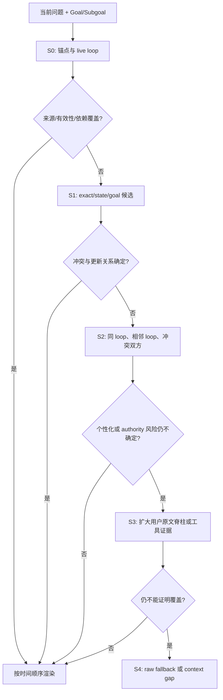

# Pi-Idea 最终上下文组装方案 v2：风险有界证据编译器

状态：`ARCHITECTURE DELIVERED / V5.2 PROTOTYPE IMPLEMENTED / PRODUCTION ADOPTION REJECTED`
日期：2026-08-14
短名：`RBEC`（Risk-Bounded Evidence Compiler）

## 1. 最终决定

Pi-Idea 不应继续寻找一个可以把所有历史统一压到固定 top-k 的选择器。最终方案是一个模型外、可逆、风险有界的证据编译器：

> raw 账本永久保存；用户确认与可验证事件形成窄状态；每轮根据当前问题、当前 Goal/Subgoal 和显式依赖生成临时证据视图。先做有证明的结构去冗余，再按来源、有效性和任务风险逐级展开；无法证明覆盖就恢复更多原文，直到 raw 或 85% 硬线。永远不拿任务表现换压缩率。

当前 v5.2 原型证明了该架构可以在 CPU 上极快运行，并能显著减少 token；但它也证明了一个重要反例：**仅凭正则、词项相似度和时间顺序，不能可靠断言一条隐含偏好已经被另一条取代。** 因此 v5.2 不接入生产，默认继续保持 `safe` 原生上下文。

优化目标按字典序排列：

\[
\max \; \text{TaskSuccess}
\succ \max \; \text{AuthorityCorrect}
\succ \min \; \text{InputTokens}
\succ \min \; \text{AssemblyLatency}
\]

“最小充分上下文”只是逼近目标。系统不声称能在运行时证明全局最小，只证明：每项删除有来源规则，每项召回有原文地址，每次停止有覆盖和风险理由。

## 2. 四种不同对象，不能再混在一起

### 2.1 Raw Ledger：永久、不可变、可追溯

保存 Pi 原始 session event，包括用户输入、助手公开输出、工具调用、工具结果、时间、parent、branch、session 和恢复地址。raw 默认不删；100 GiB 只触发容量复核，不能自动授权删除。

raw 是来源记录，不是真值数据库。用户消息对其意图、偏好、授权和约束有权威；工具结果对外部事实有证据价值；助手旧输出只是历史工作，不能自动成为事实或用户决定。

### 2.2 Trusted State：窄、版本化、只能由强事件更新

状态只保存：

- 用户确认的 Idea/目标、版本、哈希和确认时间；
- 用户显式设置的当前阶段、决定、约束和权限；
- 经确定性验收的执行结果及其原始证据引用；
- 当前未决 loop、provider transaction 和 continuation frame。

正则检测到“我现在更喜欢……”只能产生**候选状态变化**，不能直接让旧 raw 失效。只有显式用户确认、结构化命令或可验证事件才能写入状态并产生 `supersedes` 边。

### 2.3 Locator Index：可重建、很小、不作为事实

每个 user-to-user loop 形成最多两个逻辑块：

1. `dialogue`：本轮用户输入与助手公开输出；
2. `tool-evidence`：工具结果；tool call 参数只保留 provenance，不注入模型。

长消息允许内部切片用于定位，但召回时恢复完整逻辑事件或完整 island。Locator 只保存：block/event/loop ID、原文 hash、role、authority source、session/time、Goal/Subgoal、文件/符号/实体、显式引用、state key/version、depends-on、validates、contradicts、supersedes 和 raw 地址。

### 2.4 Ephemeral View：一次性模型输入

上下文视图只为当前调用存在，用后丢弃，不写回 raw，不递归压缩，也不把模型本轮解释升级成状态。

## 3. 为什么系统能知道“下一轮需要什么”

它并不预知下一轮。下一轮真正到来后，组装器才同时观察：

- 当前用户问题；
- 当前确认 Goal、Subgoal、阶段和未决项；
- 当前 live loop 与 continuation frame；
- 文件、符号、任务 ID、实验 ID 等显式引用；
- 历史 locator 的词项、时序、来源、状态和依赖边。

查询框架为：

\[
Q_t = \operatorname{Frame}(u_t, G_t, S_t, F_t, R_t)
\]

候选生成不是一次 top-k，而是多通道并集：

\[
K = K_{exact} \cup K_{goal} \cup K_{state} \cup K_{lexical}
\cup K_{recency} \cup K_{dependency} \cup K_{conflict}
\]

裸“继续”不做语义猜测：直接恢复最新未决 continuation frame、对应完整 loop 和显式依赖。普通具体问题则用问题本身做主要检索键。

## 4. 组装算法

### 4.1 第一步：带证书的确定性排除

只有下列内容可以直接不进 prompt：

- assistant thinking、UI spinner/progress；
- tool call/command 参数；
- 已有最终事件覆盖的流式中间片段；
- hash 与 source identity 均相同的重复 ingest；
- 明确标记 `excludeFromContext` 的内容；
- 有共享 state key、版本关系和原文引用的显式 superseded 状态。

年龄、低相似度、低热度、助手判断或正则推断都不能成为删除证书。未物化内容仍是 `LOCATOR_ONLY / RAW_LEDGER_RETAINED`，物理删除永远为零。

### 4.2 第二步：风险路由，而不是统一压缩

| 查询风险 | 初始视图 | 何时升级 |
|---|---|---|
| 明确独立事实问题 | 当前问题 + 来源规则；历史可为空 | 问题显式引用历史、文件或外部证据 |
| Goal/“继续” | Goal + 窄状态 + 未决完整 loop | continuation 缺失或依赖不闭合 |
| 个性化推荐 | 已确认偏好状态 + 相关用户原文 | 没有确认状态、存在冲突、更新关系不确定时，扩大到更多用户原文；禁止启发式删旧偏好 |
| 证据与偏好冲突的决策 | 当前要求 + 工具证据 + 用户约束 | 证据来源缺失、冲突未闭合时恢复完整检索/工具 island |
| 多人/共享范围决策 | 当前情境 + 相关个人偏好 + scope rule | 无法区分用户约束与他人约束时恢复完整邻域 |
| 普通科研推进 | Idea/Goal + 当前 Subgoal + active files/evidence + unresolved + live tail | 缺验证证据、跨分支引用或目标漂移风险时展开历史 |

低风险路径可以很短；高风险路径宁可多放。压缩预算不能强迫高风险路径使用同样的 token 比例。

### 4.3 第三步：证据充分性阶梯

“充分”不是语义真值证明，而是可检查合同：显式引用已解析、必需依赖闭合、冲突双方可见、有效版本可见、当前 Goal/未决项可见、authority 来源不混淆。任一项未知都提高风险，不得因为预算而假设它不存在。

### 4.4 第四步：保持时间顺序与来源边界

v5.0 曾按 `USER / TOOL / ASSISTANT` 分组渲染，破坏了事件时间关系，导致证据和结论错位。最终方案改为：

1. confirmed Goal/State anchor；
2. 简短 source/task policy；
3. cold evidence 按 ledger 时间顺序；
4. live loop 按原始顺序；
5. 当前用户问题只出现一次。

来源类型保留在每条证据的 metadata 中，不再通过重排来表达 authority。

### 4.5 第五步：预算与停止

- 60%：软线。覆盖充分就停，不为填满预算加入无关历史；
- 60–85%：只有闭包、冲突、authority 或验证证据需要时才展开；
- 85%：完整输入死线。不能再扩时输出明确 `context_gap`，或拆分当前任务；禁止截断半条事实。

组装器不在热路径调用模型，不使用生成式摘要。模型摘要可以离线作为低权重 locator 候选，但不能作为唯一记忆，也不能让 raw 失去可恢复性。

## 5. 索引与性能实现

建议 SQLite WAL + FTS5，项目隔离：

- `events`：不可变事件与 raw hash/ref；
- `loops`：dialogue/tool-evidence island 边界；
- `locators`：FTS、文件、符号、实体和显式引用；
- `state_events`：用户确认/验证事件；
- `edges`：depends/validates/contradicts/supersedes；
- `continuations`：未决 loop 与 block IDs；
- `assembly_audit`：query hash、选择理由、token、gap 和输出 hash。

切段与索引在单 worker thread 中异步、串行批处理。context hook 只读最后已提交快照，不等待后台切片。索引丢失可从 raw 重建；索引清理不影响 raw。

Obelisk 作为兼容层：只有显式历史缺口或跨项目/旧会话查找时才生成有界 lookup plan，验证文本与 hash 后转成普通 external evidence。Obelisk 不介入每轮热路径，也不成为第二个记忆真源。

## 6. 文献依据与改造边界

- [ACON](https://arxiv.org/html/2510.00615)：采用“任务奖励优先于上下文成本”和失败配对驱动策略优化；拒绝在线模型摘要。
- [RaMem](https://arxiv.org/html/2606.22844)：采用时间/会话/参与者等 recall condition、validity 排序和 content fallback。
- [ECoRAG](https://aclanthology.org/2025.findings-acl.1365/)：采用从最小证据集开始、不足再取证；改成确定性覆盖合同，不增加每轮反思模型。
- [LongLLMLingua](https://aclanthology.org/2024.acl-long.91/)：采用问题感知分区预算和重排；拒绝破坏原文的 token 级裁剪。
- [HiAgent](https://aclanthology.org/2025.acl-long.1575/)：采用 Goal/Subgoal/loop 层次；拒绝把旧子目标只保存成生成式摘要。
- [Context Length Alone Hurts](https://aclanthology.org/2025.findings-emnlp.1264/)：支持即使检索正确也应避免无谓长上下文，并支持证据先行。
- [LongHorizon-Harness](https://arxiv.org/html/2608.01964)：采用显式外部状态、状态/轨迹分离和 verified-only 更新。
- [MM-Mem](https://arxiv.org/abs/2603.01455)：采用多分辨率、按不确定性向下钻取；用可逆原文层替代 gist 唯一记忆。
- [Memora](https://arxiv.org/abs/2604.20006)：采用对 obsolete/invalid reuse 的惩罚，说明仅优化 recall 不够。
- [Memory-R2](https://arxiv.org/abs/2605.21768)：采用冻结中间状态后的 matched rerollout，而非对不同轨迹粗暴归因。

全部 111 条检索结果、失败源和噪声保存在 [allinone.md](../allinone.md)。

## 7. 实现与验证结果

v5.2 实现位于 `pi-idea-extension/src/evidence-context-compiler.js` 的 `compileEvidenceLadderContext`。它不接生产默认，也不替换 v4。

CPU-only 全量 1,550 case：

- 溢出：`0/1550`；
- raw mean：`2043.73 tokens`；
- v5.2 mean：`1256.75 tokens`；
- case 平均压缩：`36.79%`；
- 组装 `p95 = 2.45ms`，最大 `3.38ms`。

第三批独立 Luna-low 门（32 个新 case，排除 152 个历史模型 case）：

- task success：`75.00% -> 81.25%`，`+6.25pp`；
- authority：`81.25% -> 90.63%`，`+9.38pp`；
- mean context tokens：`2174.25 -> 1132.72`，`-47.90%`；
- 任务 discordant：候选独赢 `6`，raw 独赢 `4`；
- 单侧精确 McNemar `p = 0.37695`，未达到预注册 `p <= 0.10`；
- retrieval-missing：`1 -> 5`，其中个性化任务 `0 -> 4`。

所以：点估计、authority、压缩和延迟均改善，但**显著性与个性化召回安全没有通过**。按冻结合同，`SolEligible = false`，未执行 Sol 测试，生产默认保持 `safe`。

## 8. 可交付边界

已经可以交付并保留：

- raw/state/view 分离；
- loop + tool-evidence 双 island；
- 可逆 locator、来源 metadata、依赖闭包；
- 确定性结构排除；
- Goal/continuation 精确恢复；
- 60%/85% 水位；
- CPU 异步索引与毫秒级组装；
- Obelisk 有界兼容；
- v5.2 实验编译器、冻结协议、预算账本和完整结果。

当前不能宣称已解决：

- 在没有用户确认状态时，可靠识别隐含偏好更新；
- 在大幅压缩下保持所有个性化任务不漏召回；
- 相对 raw 显著提高总体任务成功；
- Sol 上达到可启用门槛。

下一阶段真正值得啃的硬骨头不是再换随机森林，而是：**如何把“偏好是否仍有效”变成可验证状态事件，或者在不确定时用低成本宽召回恢复足够多的用户原文。** 在解决它之前，个性化/authority 高风险路径必须保守展开。
