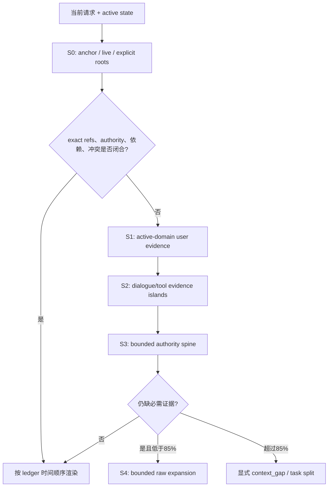

# Pi-Idea 最终上下文组装方案 v3

状态：`IMPLEMENTED / INDEPENDENT LUNA PASSED / FIXED 5% SOL PASSED / PRODUCTION ADOPTED`
日期：2026-08-14
实现：`proof-carrying-dialogue-islands-v6.4`

## 结论

Pi-Idea 的长期记忆不是一个不断增长的 prompt，也不是一份反复总结的“总记忆”。它是模型外状态机：

> 永久保存可追溯 raw；只把用户确认和可验证事件归约为窄状态；用小 locator 找候选；每次 loop 依据当前问题和 active Goal 编译一次性逐字证据视图。确认无用的结构噪声从 prompt 排除，暂时无关的原文只降为 locator；证据不足就恢复完整事件，任务表现永远优先于压缩率。

优化顺序固定为：

\[
TaskSuccess \succ AuthorityCorrect \succ InputTokens \succ CPU\ Latency
\]

“最小充分上下文”是逼近目标，不宣称能证明全局最小。系统能证明的是：为什么保留、为什么不物化、缺什么、从哪里恢复，以及是否触碰 60%/85% 水位。

## 状态空间

### 1. Raw Ledger

- Pi session event 逐字、append-only、带 session/entry/parent/time/hash/raw locator；
- 用户原话对意图、偏好、约束和授权有权威，但不自动证明外部事实；
- tool result 是有来源的外部证据；prior assistant 是非权威历史工作；
- raw 默认永久保存。100 GiB 只触发容量复核，除非用户明确要求，不自动删除。

### 2. Trusted State

只允许强事件写入：已确认 Idea 及版本、stage、用户显式决定/权限/约束、确定性验收结果、未决 loop 和 continuation frame。正则只能产生召回信号，不能把隐含偏好直接升级为真状态。

### 3. Locator Index

每个 user-to-user loop 产出最多两个 assembly island：

- `dialogue`：用户输入与 assistant 公开输出；
- `tool-evidence`：tool result；tool call/command 参数只留在 raw provenance。

长事件可按段落/行/句子/空白做非重叠 locator 切片，单片硬上限 768 tokens；命中内部片段时恢复整个 logical event。索引保存 ID、hash、authority、Idea/stage、显式 refs、state version 和 dependency edges，不是事实源，损坏可从 raw 重建。

### 4. Ephemeral Evidence View

当前 user request 始终独立传给 Sol。组装器只生成本轮历史 evidence view，用后丢弃，不递归写回，不把模型总结当唯一记忆。

## 检索与组装

组装器不预知下一 loop。问题到来后，构造：

\[
Q_t = Frame(UserRequest_t, Idea_t, Stage_t, State_t, Unresolved_t, ExplicitRefs_t)
\]

候选来自 exact ref、active Idea/stage、用户 authority update、continuation roots、依赖/冲突边、FTS lexical 和最近有效事件。active Idea/stage 是 domain boundary：同项目候选存在时，异项目内容保持 locator-only。

硬优先级：

1. explicit continuation / fresh / unresolved roots；
2. active Idea 内用户更新、偏好和 scope authority；
3. 当前问题匹配的用户 raw；
4. consequential tool/assistant evidence；
5. dialogue-island bridge；
6. lexical、recency、heat 和可选 reranker。

随机森林没有成为删除判别器。可选 forest 只能重排 soft candidates，不能覆盖 authority、exact ref、dependency closure 或硬预算。

### 风险路由

| 当前请求 | 初始材料 | 关键保护 |
|---|---|---|
| 独立事实题 | 当前问题 + source policy；历史可为空 | 用户偏好不当作事实证据 |
| “继续”/Goal 推进 | Goal/state + latest unresolved frame + exact roots | 不对“继续”做词面猜测 |
| 个性化推荐 | 有界 user authority spine + 相关 dialogue islands | 负面经历的原因转为正约束；后来的明确更新覆盖旧冲突 |
| 偏好与证据冲突 | 用户约束 + consequential evidence | 证据决定可行性，偏好只决定 trade-off |
| 多人/共享 scope | 当前情境 + 有关个人偏好 | 个人偏好不外推到他人 |
| 普通科研推进 | Idea/stage + active files/results + unresolved + live tail | 验证事实、提案和权限严格分层 |

### 充分性阶梯

60% 是软线；覆盖充分时不会为填满预算增加历史。证据闭包需要时可扩到 85%。85% 是完整输入死线：不能放入完整必需事件就给出 gap，禁止截断半条事实。

## 什么保留、什么排除

只有具备结构证书时才从 prompt 排除：assistant thinking、UI progress、tool call 参数、被最终事件覆盖的中间流、明确 `excludeFromContext` 内容、hash/source identity 完全重复项。低相似度、年龄、低热度和 assistant 判断都不能成为物理删除理由。

三种 disposition：

- `MATERIALIZED`：本轮逐字进入 evidence view；
- `LOCATOR_ONLY`：本轮不进 prompt，但 raw 保留且可恢复；
- `EXCLUDED_FROM_PROMPT`：有结构 drop certificate，raw 仍按账本策略保存。

每轮 Manifest 记录 query/input/output hash、root reason、selected/deferred/dropped blocks、source authority、token、水位、gap 和 assembly latency。

## 热路径与 Obelisk

SQLite WAL + FTS5 在单 worker 中异步、串行、每批 8 entries。context hook 只读最后提交快照；切分、索引和 checkpoint 不阻塞 loop，也不调用模型。

Obelisk 只在显式历史请求、跨项目旧会话或 compiler gap 时生成有界 lookup plan。返回文本必须满足可见文本、完整性与 hash 校验后，才能作为 external evidence 进入普通编译流程。Obelisk 不进入每轮 hot path。

## 两层 run loop

默认只保留两层：

1. **Sol research loop**：拥有 Idea、研究判断、解释、下一步和最终 authority；reasoning 不受 Pi-Idea 限制。
2. **Workflow loop**：worker/tool 只获得冻结 task card、必要证据 roots、工作区/权限边界和验收合同；返回结果、证据与显式状态增量，不继承主对话全历史。

“自我推进/讨论”采用显式 UI 模式作为上界，保守判别器只建议切换。目标歧义、权限扩张、不可逆动作或证据不足才阻塞询问；普通可逆推进自动继续。

## 验证证据链

### Luna v2 未见长程门

16 个新目标，排除 310 个曾进入任何 frozen-online 模型运行的目标；每个目标埋入 8 个异项目历史，三条件为 raw-long、透明 rolling-extractive 和 evidence-ladder。

- task：rolling `50.00%`，raw `68.75%`，candidate `87.50%`；candidate vs rolling `6:0`，one-sided exact McNemar `p=0.015625`；
- authority：rolling `62.50%`，raw `87.50%`，candidate `93.75%`；
- mean token compression vs raw：`90.91%`；
- assembly P95：`6.24 ms`；
- 96 calls，786,268 charged tokens，0 failures；全部冻结门通过。

### Sol/max 固定 5% 正式门

78 个再次全新的目标，排除 326 个已见目标；manifest 在任何答案生成前冻结；raw/candidate 先全部封存，再做 condition-blind post-hoc judge reversal。模型为 `gpt-5.6-sol:max`，CPU-only，串行。

| 指标 | raw-long | candidate | 配对差 / 95% CI |
|---|---:|---:|---:|
| task success | 85.90% | 94.87% | `+8.97pp`, `[+2.56,+16.67]pp`, 8:1 |
| authority correct | 85.90% | 96.15% | `+10.26pp`, `[+2.56,+17.95]pp`, 9:1 |
| mean context tokens | 19,232.38 | 1,518.64 | `-92.10%` |
| assembly P95 | 7.63 ms | 3.89 ms | `<100 ms` |

所有正式 gate 为 true。预算记录 312 实际调用、2,970,694 tokens、0 failed calls、0 conservative charges。production 因此默认启用 evidence assembly；`PI_IDEA_CONTEXT_MODE=safe` 保留为人工回退。

### CPU 与测试

- 扩展：`89/89` pass；研究协议：`58/58` pass；
- 5,000 blocks / 4,001 messages / 1,000 iterations：普通 loop P95 `0.857 ms`，continuation P95 `1.260 ms`；
- 后台调度调用 P95 `0.010 ms`；19,601-char 无模型切分 P95 `1.760 ms`，逐字重建成功。

## 失败史与为什么 v6.4 有效

早期 selector 在 70 对中 task `94.29% -> 87.14%`、authority `100% -> 91.43%`，证明“删得更多”会伤害任务。v4 仍在 -5pp task 非劣边界外。v5.2 虽有正点估计，却在个性化任务产生 4 个 retrieval miss。Sol v6.1 又在 valid-memory selection 暴露自然语言偏好反转漏召回，严格 CI 仅差 0.128pp 未过。

v6.4 的修复不是扩大统一 top-k，而是：active Idea/stage 硬域隔离；用户 authority spine；个性化 dialogue islands；识别 `our taste`、`past experience` 等隐式个性化请求；把 `drifting away / now into / resubscribed` 等自然更新纳入召回信号；事实题隔离错误偏好；保持 ledger 时间序。失败结果全部保留，未与新样本合并制造显著性。

## 局限

- 多项目长程场景由真实 MemSyco history 合成，不是自然数周科研部署；
- rolling-extractive 是透明可审计近似，不是 Codex 私有 compactor；
- Sol 同时担任 subject 和 post-hoc evaluator，不等于人类盲评；
- benchmark 覆盖五类记忆/authority 风险，尚不能证明所有 EqOp 类科研工作都不会漂移；
- production 在正式门后增加了“外部 live tail 已单独保留”和“exact/continuation roots 强制闭包”的确定性 adapter，保持 benchmark 默认编译行为不变，并由本地测试覆盖；未再消耗模型做第三次正式门。

## 可复现入口

- 编译器：`pi-idea-extension/src/evidence-context-compiler.js`
- production adapter：`pi-idea-extension/src/production-context-assembly.js`
- Luna manifest：`research/benchmarks/bidirectional-context/results/long-horizon-luna-gate-v2-manifest.json`
- Luna result：`research/benchmarks/bidirectional-context/results/long-horizon-luna-gate-2026-08-13T19-32-59-784Z-8f30f13c.json`
- Sol manifest：`research/benchmarks/bidirectional-context/results/long-horizon-sol-5pct-v2-manifest.json`
- Sol result：`research/benchmarks/bidirectional-context/results/long-horizon-sol-5pct-e963f5d3d880-result.json`
- 文献清单与检索失败记录：`allinone.md`

主要设计来源包括 [ACON](https://arxiv.org/html/2510.00615)、[RaMem](https://arxiv.org/html/2606.22844)、[ECoRAG](https://aclanthology.org/2025.findings-acl.1365/)、[LongLLMLingua](https://aclanthology.org/2024.acl-long.91/)、[HiAgent](https://aclanthology.org/2025.acl-long.1575/)、[Context Length Alone Hurts](https://aclanthology.org/2025.findings-emnlp.1264/)、[LongHorizon-Harness](https://arxiv.org/html/2608.01964)、[MM-Mem](https://arxiv.org/abs/2603.01455)、[Memora](https://arxiv.org/abs/2604.20006) 与 [Memory-R2](https://arxiv.org/abs/2605.21768)。论文提供设计假设，本地冻结配对门才提供采用证据。
